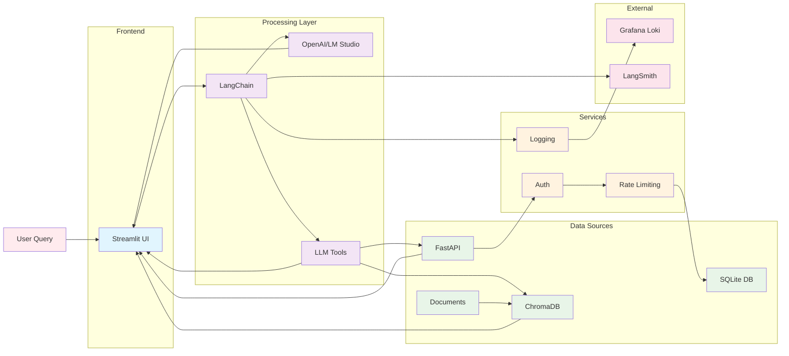

# Campaign Performance Assistant - Data Flow

## Description

This diagram illustrates how data flows through the Campaign Performance Assistant system:

### **Process Flow**

1. **User Query** → Streamlit UI
2. **Streamlit** → LangChain (AI orchestration)
3. **LangChain** → LLM (OpenAI/LM Studio)
4. **LLM** → Tool Selection
5. **Tools** → Data Sources (FastAPI/ChromaDB)
6. **Data Sources** → Response Generation
7. **Response** → UI Display with Source Attribution

### **Data Sources**

- **FastAPI**: Structured campaign metrics
- **ChromaDB**: Document content search
- **SQLite**: Campaign database queries

### **Key Features**

- **Bidirectional flow**: Data flows both ways for queries and responses
- **Multiple data sources**: Combines structured and unstructured data
- **Service integration**: Authentication, logging, and monitoring
- **External services**: Grafana Loki for logging, LangSmith for monitoring 