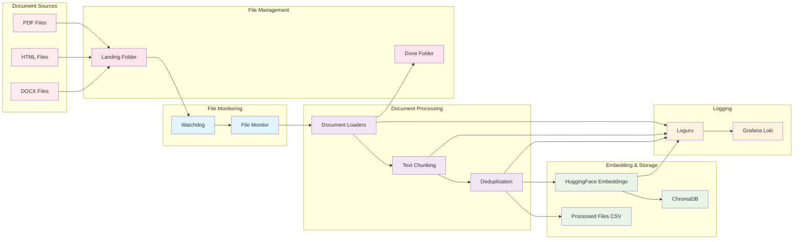

# Campaign Performance Assistant - Document Ingestion Pipeline

## Description

This diagram shows the complete document ingestion pipeline from file upload to vector database storage:

### **Processing Steps**

1. **File Upload**: PDF, HTML, DOCX files placed in landing folder
2. **File Monitoring**: Watchdog detects new files
3. **Document Loading**: Appropriate loader extracts text
4. **Text Chunking**: Documents split into 1000-character chunks
5. **Deduplication**: MD5 hash-based duplicate detection
6. **Embedding Generation**: HuggingFace embeddings created
7. **Vector Storage**: Embeddings stored in ChromaDB
8. **File Movement**: Processed files moved to done folder
9. **Logging**: All steps logged to Grafana Loki

### **Supported Formats**

- **PDF**: PyPDFLoader
- **HTML**: UnstructuredHTMLLoader  
- **DOCX**: UnstructuredWordDocumentLoader

### **Key Features**

- **Automatic processing**: Background service monitors for new files
- **Deduplication**: Prevents duplicate document processing
- **Chunking**: Optimizes for vector search performance
- **Comprehensive logging**: All steps tracked for debugging
- **File management**: Organized folder structure 