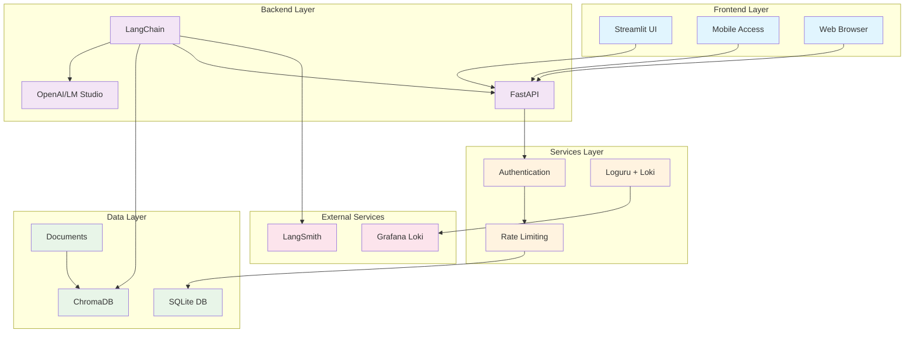

# Campaign Performance Assistant - System Architecture

## Description

This diagram shows the complete system architecture of the Campaign Performance Assistant:

### **Frontend Layer**
- **Streamlit UI**: Web-based chat interface
- **Mobile Access**: Responsive design for mobile devices  
- **Web Browser**: Standard web access

### **Backend Layer**
- **FastAPI**: REST API for structured data access
- **LangChain**: AI orchestration and tool management
- **OpenAI/LM Studio**: Large Language Model processing

### **Data Layer**
- **SQLite DB**: Structured campaign data storage
- **ChromaDB**: Vector database for document embeddings
- **Documents**: Multi-format document storage

### **Services Layer**
- **Authentication**: API key-based security
- **Rate Limiting**: Request throttling
- **Logging**: Loguru + Grafana Loki integration

### **External Services**
- **Grafana Loki**: Log aggregation and visualization
- **LangSmith**: LLM monitoring and debugging 