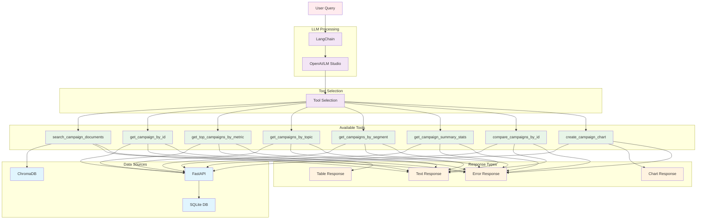

# Campaign Performance Assistant - Tool Selection Flow

## Description

This diagram shows how the LLM selects and uses different tools based on user queries:

### **Available Tools**

| Tool | Purpose | Data Source |
|------|---------|-------------|
| `search_campaign_documents` | Document content search | ChromaDB |
| `get_campaign_by_id` | Specific campaign data | FastAPI |
| `get_top_campaigns_by_metric` | Top performers | FastAPI |
| `get_campaigns_by_topic` | Topic-based filtering | FastAPI |
| `get_campaigns_by_segment` | Segment-based filtering | FastAPI |
| `get_campaign_summary_stats` | Overall statistics | FastAPI |
| `compare_campaigns_by_id` | Campaign comparison | FastAPI |
| `create_campaign_chart` | Chart generation | FastAPI |

### **Tool Selection Logic**

The LLM analyzes user queries and selects the most appropriate tool based on:

- **Keywords** in the query
- **Intent** (search, compare, analyze)
- **Data type** needed (structured vs. document content)
- **Response format** required (text, table, chart)

### **Response Types**

- **Text Responses**: Natural language explanations
- **Table Responses**: Structured data in tabular format
- **Chart Responses**: Interactive visualizations
- **Error Responses**: Clear error messages with guidance 